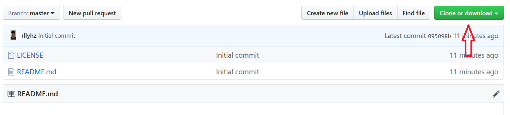

<a id="table-of-content"></a>
## Table of Contents

| No | Content |
| --- | --- |
| 0 | [Introduction](#introduction) |
| 1 | [Environment Setup](#env-setup) |
| 2 | [How To Run this App](#how-to-run) |
| 3 | [Configuration For Yourself](#configuration) |
| 4 | [File Source Code](#file-source-code) |
| 6 | [Follow Me Here](#follow-me) |
| 5 | [References](#references) |


<a id="introduction"></a>
# Hello My Georgeous Friends in The Internet ◕ ‿ ◕

[Today](# "11 December 2019"), I created something awesome and want to share with yall. That's my first **Text Editor App** in `Python`. It is a `Text Editor` but not so complicated yet as another the most known text editor such as `Notepad`, `Sublime Text`, `Visual Studio Code`, etc. You can run this app in Windows, Linux and MacOs as well. I hope you enjoyed this app and please feel free to download it and share with your another gorgeous friends around the world! :)

**Love yall** ~emotLove* ❤ 

<br />

[**🡹 Go to the top**](#introduction)

[**🡹 Go to the Table of Contents**](#table-of-content)

<br />

<a id="env-setup"></a>
## Environment Setup

As I mentioned before, this app is built using [`Python`](https://www.python.org/ "Python's Official Website") language. Highly recommended [`Python3.x`](https://docs.python.org/3/ "Python3.8") version. I don't recommend you to install [`Python2.x`](https://docs.python.org/2/ "Python 2.7.14 the last released") because this app was built using [`Python3.x`](https://docs.python.org/3/ "Python3.8") version. And the dependency was be using on it is only [`tkinter`](https://docs.python.org/3.8/library/tkinter.html "Tkinter Module") module which is a GUI module in [`Python`](https://www.python.org "Python's Official Website") language. Finally, if there is no [_Python Interpreter_](https://en.wikipedia.org/wiki/Python_(programming_language)) on your [OS](https://en.wikipedia.org/wiki/Operating_system) (Operatin System) then you have to install [`Python`](https://www.python.org/downloads/ "Download Here Now!") before continuing the steps below.

_Luckily_, you don't have to install this module anymore due to it is built-in module in python already. So give thanks to the [`creator of Python`](https://en.wikipedia.org/wiki/Python_(programming_language) "Created by Guido van Rossum") language and let's get started!

<br />

[**🡹 Go to the top**](#env-setup)

[**🡹 Go to the Table of Contents**](#table-of-content)

<br />


<a id="how-to-run"></a>
## Let's play!

**Follow this instruction for the happy fun!**

1. Please install [`Python`](https://www.python.org/downloads/ "Download Here Now!") language if it hasn't been intalled on your OS (Operating System) yet.
1. Download the Source Code [here](#file-source-code "Just Click!").
1. Open cmd (If you're on Windows), Terminal (Linux) or Iterm (MacOs).
1. Go to the path where the folder of the app is placed (with command cd `\Path\to\...\TextEditor`).

    ```bash
    cd \path\to\...\TextEditor
    ```

1. Hit enter to run the command.
1. Type the following command to run the script.

    On Windows:

    ```bash
    python PyTextEditor.py
    ```

    On MacOs or Linux:

    ```bash
    python3 PyTextEditor.py
    ```

1. Hit enter again.
1. And have fun!

<br />

[**🡹 Go to the top**](#how-to-run)

[**🡹 Go to the Table of Contents**](#table-of-content)

<br />


<a id="configuration"></a>
## Configuration For Yourself

Now, these are all you can do to this awesome app.

### Set The Name, The Author, and The Version of The App

Open file `PyTextEditor.py` and look at this lines of code:

```python
...
APPNAME = "PyTextEditor"
AUTHOR = "Rully Ihza Mahendra"
APPVERSION = "0.1"
...
```

You can change the value of `APPNAME`, `AUTHOR`, and `APPVERSION` to your own.

```python
...
APPNAME = "PyTextEditor"
AUTHOR = "Rully Ihza Mahendra"
PyVersion = '3.8'
APPVERSION = "1.0"
MSG = 'A Simple and Awesmoe Text Editor in Python ' + PyVersion
...
```

<br />

[**🡹 Go to the top**](#configuration)

[**🡹 Go to the Table of Contents**](#table-of-content)

<br />


<a id="file-source-code"></a>
## Now The Source Code is Yours

### Cloning this repo

On windows, [`Git`](https://git-scm.com/) **must be installed** in your computer before running the command below in Git Bash:
```bash
git clone https://github.com/rllyhz/PyTextEditor.git
```

On MacOs or Linux
```bash
sudo git clone https://github.com/rllyhz/PyTextEditor.git
```
Or you can click the '**Clone or download**' button available in this repo above to download it directly:



<br />

[**🡹 Go to the top**](#file-source-code)

[**🡹 Go to the Table of Contents**](#table-of-content)

<br />


<a id="follow-me"></a>
## Thank You

> _"Thank you for visiting my weekly project. Hope you enjoyed this app!"_

If you love this project, please give me some loves and supports by visiting and following my social media as well to look at some of my next awesome weekly projects, here:
- Instagram -> https://www.instagram.com/rllyhz/
- Twitter -> ...

**_Follow me and stay tuned!!_**

<br />

[**🡹 Go to the top**](#follow-me)

[**🡹 Go to the Table of Contents**](#table-of-content)

<br />


<a id="references"></a>
## References

| Name | Detail |
| --- | --- |
| Python | https://www.python.org/ |
| Python | https://www.python.org/downloads/ |
| Tkinter Module | https://docs.python.org/3.8/library/tkinter.html |
| Creator of Python | https://en.wikipedia.org/wiki/Python_(programming_language) |
| Wikipedia | https://en.wikipedia.org/wiki/Operating_system |

<br />

[**🡹 Go to the top**](#references)

[**🡹 Go to the Table of Contents**](#table-of-content)

<br />

